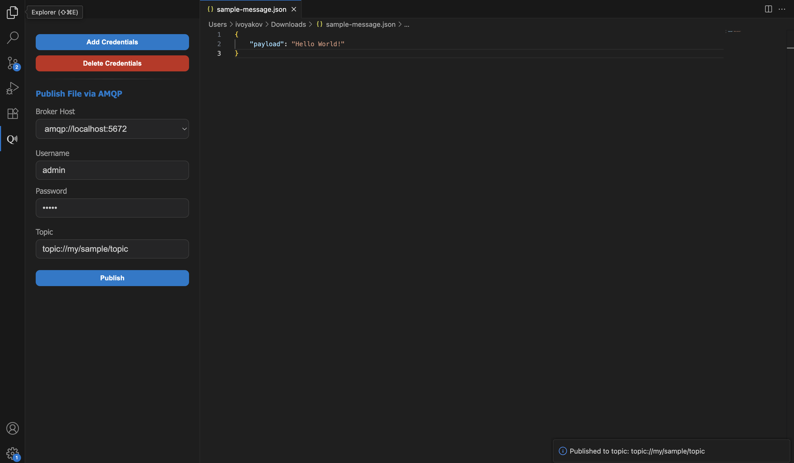

# VS Code → AMQP (1.0) one-click publisher

Publish the contents of your current editor to an AMQP 1.0 broker straight from a tidy VS Code sidebar. Save multiple broker credentials securely, switch between them in a dropdown, and fire messages without leaving your editor.

---

## ✨ Features

- **Sidebar UI** (Webview) to publish the *active editor’s* text to an AMQP topic/address  
- **Multiple brokers + credentials** saved and selectable from a dropdown  
- **AMQP 1.0** publishing using [`rhea`](https://github.com/amqp/rhea)  
- **TLS support** (`amqps://`); automatic default ports (`5671` for TLS, `5672` otherwise)  
- **Nice-to-have UX**: add/delete credentials, minimal dark UI

---

## 🚀 Quick start

1. **Launch the extension**
   - You’ll see the **QEmit** sidebar view (id: `qemitForm`).  
     If you don’t, open *View → Appearance → Primary Side Bar*, then search for the view by name or id.

2. **Add credentials**
   - In the sidebar, click **Add Credentials**.
   - Fill in:
     - **Username**
     - **Password**
     - **Broker Host** (e.g. `amqps://broker.example.com:5671` or `amqp://localhost:5672`)
   - Save. The broker appears in the dropdown.

3. **Publish**
   - Open the file you want to publish (it must be the *active editor*).
   - Select a saved broker (or type a host if you have none saved).
   - Enter **Topic** / **Address** (e.g. `topic://your/topic/here`).
   - Click **Publish**.  
     You’ll get a toast on success, or a readable error if something fails.

---

## 🔧 Configuration & behavior

### Broker URL
- **TLS:** `amqps://host[:port]`
- **Non-TLS:** `amqp://host[:port]`

### Topic / Address
- Passed directly to `rhea` as the sender address:  
  `sender = connection.open_sender(<topicOrAddress>)`  
- Examples: `queue://queueName`, `orders`, `/amq/queue/foo` — use the addressing scheme your broker expects.
- Examples: `topic://your/topic/name` — use the addressing scheme your broker expects.

### What gets sent?
- **Exactly the full text** of the active editor as the AMQP message **body**.
- No custom headers/properties are attached.

